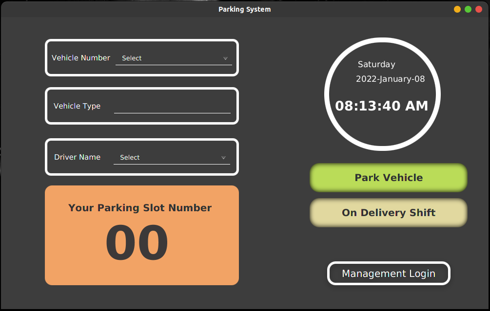
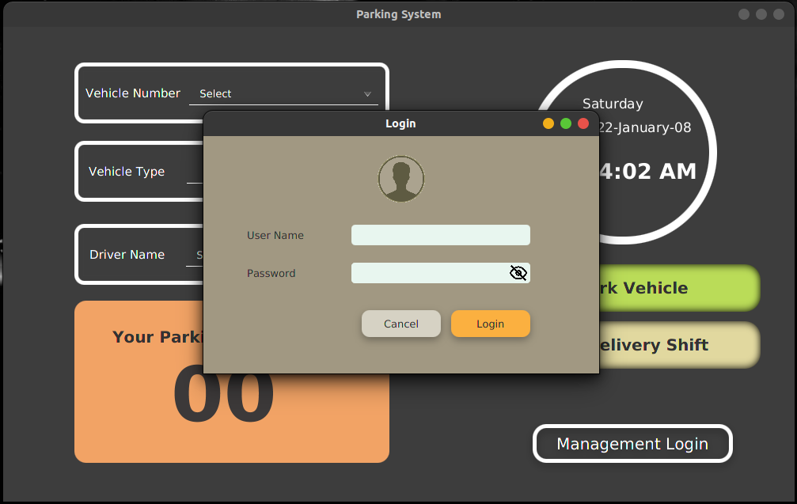
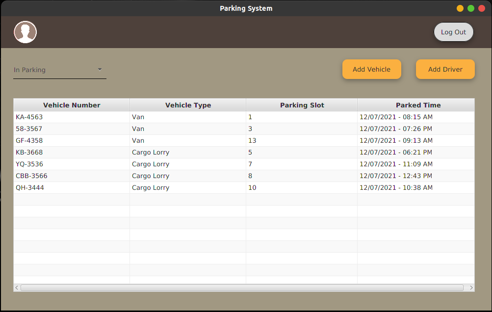
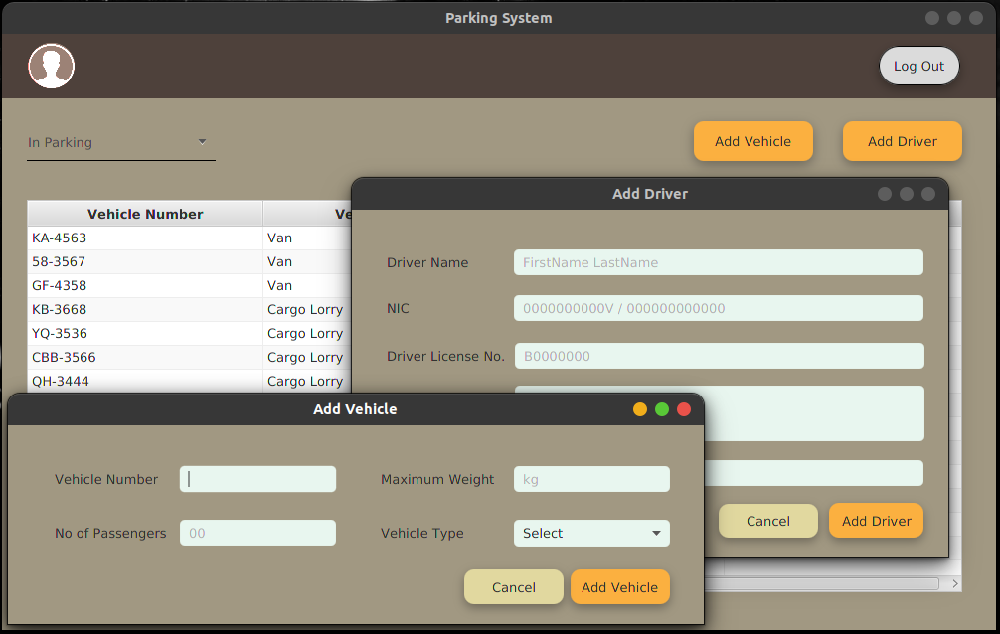

# Vehicle Parking System

Standalone application using Java for a rice distribution company. (2021 July)

## Objectives :

- Usage of Object-oriented concepts
- Java JavaFX application development
- In-memory application development
- Ability to find and learn how to display real-time on the system

 

#

 
  
  
  

